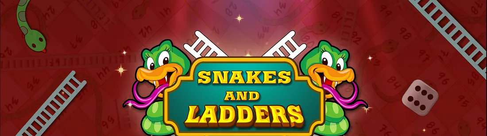
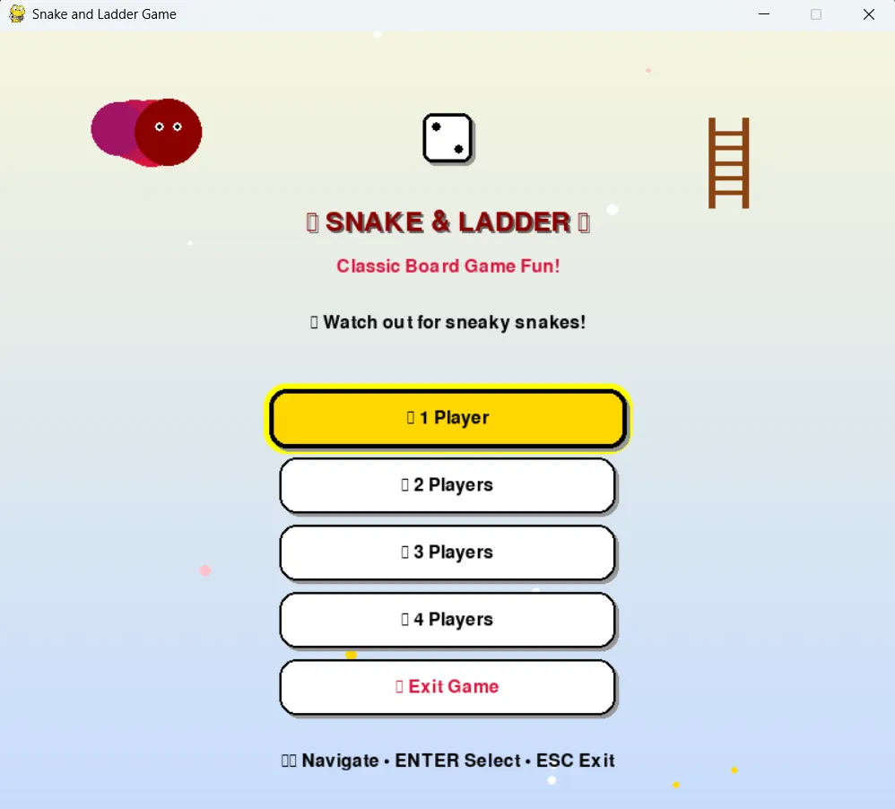
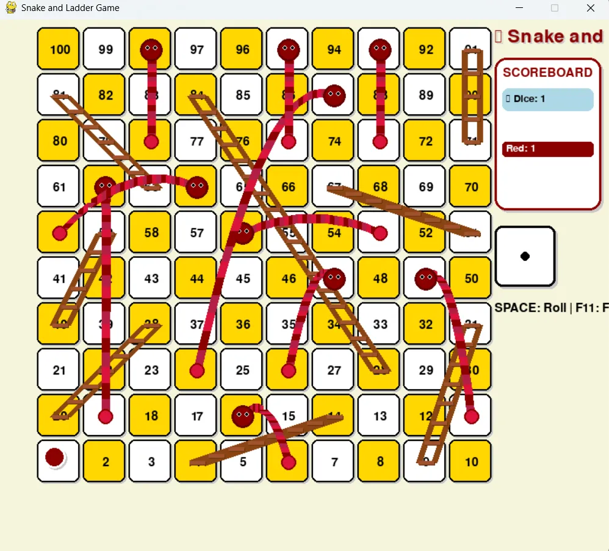

# 🐍 Snake and Ladder Game 🪜

A modern, visually stunning Snake and Ladder game built with Python and Pygame, featuring smooth animations, educational messages, and professional UI design.



## ✨ Features

### 🎨 **Visual Excellence**
- Animated start menu with floating sparkles
- Realistic snake graphics with eyes and curved bodies
- Professional ladder design with shadows and proper proportions
- Smooth step-by-step player movement animations
- Beautiful winner celebrations with professional UI

### 🌍 **Educational Impact**
- Environmental awareness messages when landing on snakes
- Positive reinforcement messages when climbing ladders
- Social responsibility integrated into gameplay

### 🎮 **Gameplay Features**
- **Multiplayer Support**: 1-4 players
- **Smooth Animations**: 60 FPS gameplay with optimized rendering
- **Professional UI**: Rounded corners, shadows, and gradient effects
- **Fullscreen Mode**: F11 to toggle fullscreen
- **Intuitive Controls**: Easy-to-use keyboard navigation

### 🎲 **Game Mechanics**
- Classic Snake and Ladder rules
- Animated dice rolling
- Step-by-step movement visualization
- Snake slides and ladder climbs with visual feedback
- Turn-based multiplayer system

## 🚀 Quick Start

### Prerequisites
```bash
pip install pygame
```

### Installation
```bash
git clone https://github.com/yourusername/snake-ladder-game.git
cd snake-ladder-game
pip install -r requirements.txt
python main.py
```

## 🎮 How to Play

### Controls
- **Menu Navigation**: ↑↓ Arrow keys + Enter
- **Roll Dice**: Spacebar
- **Fullscreen**: F11
- **Exit to Menu**: ESC
- **Quit Game**: ESC (from menu) or close window

### Game Rules
1. Players take turns rolling the dice
2. Move your token the number of spaces shown on the dice
3. **Ladders**: Climb up when you land on the bottom
4. **Snakes**: Slide down when you land on the head
5. **First player to reach square 100 wins!**

## 📁 Project Structure

```
snake-ladder-game/
├── main.py                 # Game controller and main loop
├── game/
│   ├── __init__.py
│   ├── simple_game.py      # Core game logic and rendering
│   └── simple_menu.py      # Animated start menu
├── requirements.txt        # Python dependencies
├── README.md              # This file
├── LICENSE               # MIT License
└── screenshots/          # Game screenshots
```

## 🛠️ Technical Details

### Built With
- **Python 3.7+**
- **Pygame 2.5.2**
- **Math library** for animations and curves

### Key Technical Features
- **Bézier Curves**: For realistic snake body rendering
- **Animation System**: Smooth step-by-step movement
- **State Management**: Clean separation of menu and game states
- **Modular Design**: Easy to extend and modify
- **Performance Optimized**: 60 FPS with efficient rendering

## 🎨 Customization

### Adding New Messages
Edit the message arrays in `simple_game.py`:
```python
self.snake_messages = [
    "Your custom snake message! 🐍",
    # Add more messages...
]

self.ladder_messages = [
    "Your custom ladder message! 🪜",
    # Add more messages...
]
```

### Changing Colors
Modify the color palette in `main.py`:
```python
self.colors = {
    'RED': (220, 20, 60),
    'GOLD': (255, 215, 0),
    # Customize colors...
}
```

### Adding New Snakes/Ladders
Update the positions in `simple_game.py`:
```python
self.ladders = {4: 14, 9: 31, 20: 38, ...}  # start: end
self.snakes = {16: 6, 47: 26, 49: 11, ...}   # start: end
```

## 📸 Screenshots

### Start Menu


### Gameplay


## 🤝 Contributing

Contributions are welcome! Here are some ways you can help:

1. **Bug Reports**: Found a bug? Open an issue!
2. **Feature Requests**: Have an idea? Let's discuss it!
3. **Code Contributions**: Fork, code, and submit a PR
4. **Documentation**: Help improve the docs
5. **Testing**: Test on different platforms

### Development Setup
```bash
git clone https://github.com/yourusername/snake-ladder-game.git
cd snake-ladder-game
pip install -r requirements.txt
# Make your changes
python main.py  # Test your changes
```

## 🎯 Future Enhancements

- [ ] **Sound Effects**: Dice roll, snake hiss, ladder climb sounds
- [ ] **Background Music**: Ambient game music with volume controls
- [ ] **Themes**: Multiple visual themes (space, underwater, forest)
- [ ] **Online Multiplayer**: Play with friends over the internet
- [ ] **AI Players**: Computer opponents with different difficulty levels
- [ ] **Statistics**: Track wins, games played, best scores
- [ ] **Custom Boards**: Level editor for creating custom boards
- [ ] **Mobile Version**: Touch controls for mobile devices
- [ ] **Achievements**: Unlock achievements for various milestones
- [ ] **Particle Effects**: Enhanced visual effects for celebrations

## 📝 License

This project is licensed under the MIT License - see the [LICENSE](LICENSE) file for details.

## 🙏 Acknowledgments

- **Pygame Community** for the excellent game development library
- **Classic Board Games** for the timeless gameplay inspiration
- **Environmental Education** for the awareness message inspiration
- **Open Source Community** for continuous learning and sharing

## 📞 Contact

- **GitHub**: [Ramesh0708]([https://github.com/yourusername](https://github.com/Ramesh0708))
- **LinkedIn**: [ramesh-choudhary07]([https://linkedin.com/in/yourprofile](https://www.linkedin.com/in/ramesh-choudhary07/))

## ⭐ Show Your Support

If you found this project helpful or entertaining:
- ⭐ **Star this repository**
- 🍴 **Fork it for your own modifications**
- 📢 **Share it with friends**
- 🐛 **Report bugs or suggest features**

---

**Made with ❤️ and Python**

*Combining nostalgia with modern technology to create educational entertainment!*

---

### 📊 Project Stats


